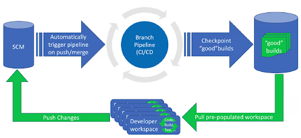

# DevOps@Scale

Another part of NetApp’s next generation DevOps solutions is DevOps@Scale. DevOps@Scale is an open-source solution that uses Kubernetes, ONTAP and Trident to deliver an end-to-end developer workflow experience.
It aims at providing an accelerated application development and facilitates management of developer workspaces. Devops@Scale delivers an efficient workspace management and improves developer productivity.
The benefits come from leveraging ONTAP's thin provisioning storage technologies like Snapshot (TBD) and FlexClone.
The solution comprises of a variety of application components all of which are deployed and run as Kubernetes services. The DevOps@Scale web application provides a dashboard to access all the deployed Kubernetes services, create/delete/access development pipelines, and create/delete/merge developer workspaces. Developer workspaces can be accessed over the web via Theia and other integrated development environments.

## Getting Started
DevOps-at-Scale is a Kubernetes based open source solution which provides:
* Centralized management of the entire Software Development Tools Ecosystem
* Centralized management of developer workspaces
* Fully containerized services environment (all deployed as Kubernetes services run within pods)
* Simplified creation of CI/CD pipelines for source code repositories
* Quick and storage efficient developer workspace creation using ontap technology
* Easy workspace access for developers via Theia IDE or NFS mounts or LUNs
* One click installation via Helm Package Manager

### Prerequisites
You will need the following setup, before installing the DevOps@Scale solution:
* A running instance of a ONTAP Cluster
* Kubernetes Cluster with a default Storage class setup
* NetApp Trident running on Kubernetes cluster
* Helm package manager (to install the solution)

Please follow the detailed instructions from the [docs](https://devops-at-scale.readthedocs.io/en/latest/prerequisites.html) to setup/install all of the above pre-requisites

### Installing

Once the above mentioned pre-requisites are met, download the code and follow the step by step installation instructions [here](https://devops-at-scale.readthedocs.io/en/latest/install.html) to deploy a running instance of DevOps@Scale.

## Usage

Start using the solution for Pipeline management operations, and workspace management operations. Detailed step by step instructions [here](https://devops-at-scale.readthedocs.io/en/latest/usage.html)

## Documentation

For more detailed instructions:
* [DevOps@Scale pre-requisites](https://devops-at-scale.readthedocs.io/en/latest/prerequisites.html)
* [Installation and setup](https://devops-at-scale.readthedocs.io/en/latest/install.html)
* [Usage](https://devops-at-scale.readthedocs.io/en/latest/usage.html)
* [Uninstall](https://devops-at-scale.readthedocs.io/en/latest/uninstall.html)
* [References](https://devops-at-scale.readthedocs.io/en/latest/references.html)
* [Support](https://devops-at-scale.readthedocs.io/en/latest/support.html)
* [License](https://devops-at-scale.readthedocs.io/en/latest/license.html)
* [Release Notes](https://devops-at-scale.readthedocs.io/en/latest/release_notes.html)

