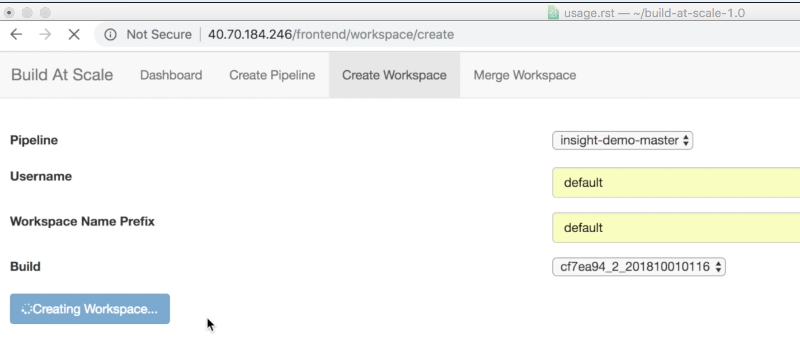
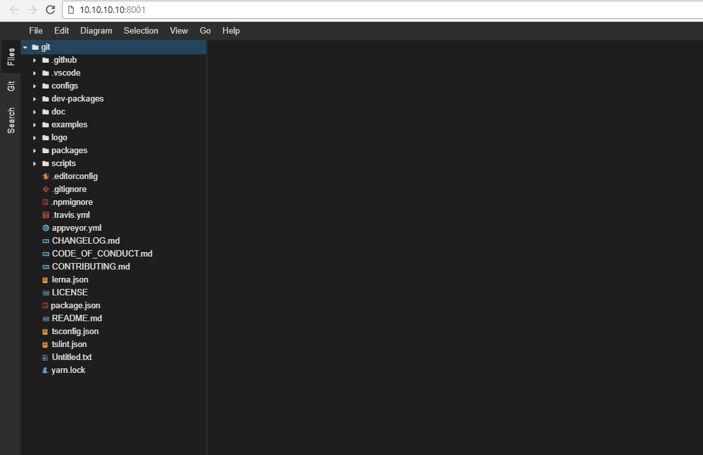

General Usage
=================================================

Pipeline Creation
--------------------------------------
Build-at-Scale pipelines can be created via pipeline creation page:
  .. code :: shell

    http://<<build-at-scale-webservice-url>/frontend/project/create

  .. figure:: images/create_pipeline.png
    :width: 100%
    :alt: Create CI Pipeline

  =======================       =======      ================================================================================================
  Parameter 	                  Value        Description
  =======================       =======      ================================================================================================
  SCM-URL                                    URL of the source code repository
  SCM-Branch                                 SCM branch off which the pipeline should run
  Export-policy                 default      Export-policy that should be used for the pipeline volume
  =======================       =======      ================================================================================================

Workspace Creation
--------------------------------------
Build-at-Scale workspaces can be created via workspace creation page:
  .. code :: shell

    http://<<build-at-scale-webservice-url>/frontend/workspace/create

  =======================       =======      ================================================================================================
  Parameter 	                  Value        Description
  =======================       =======      ================================================================================================
  Pipeline                                   Select the pipeline
  Username                                   Developer username
  Workspace prefix                           Enter a prefix which can be used to identify the workspace
  Build                                      Select the build which the workspace should be created off
  =======================       =======      ================================================================================================

  .. figure:: images/create_workspace2.png
    :width: 100%
    :alt: TheiaIDE

Once a workspace is created, you will be provided instructions on how to access your workspace via Theia Browser IDE or locally via NFS:

.. figure:: images/workspace_instructions.png
    :width: 70%
    :alt: Theia IDE

Merge Workspace Creation
--------------------------------------
Build-at-Scale merge workspaces can be created via workspace creation page:
  .. code :: shell

    http://<<build-at-scale-webservice-url>/frontend/workspace/merge

Users can merge their workspace with the latest build when they feel their workspace is out of date.

This allows users to pull in the latest code and artifacts into their workspace , thus potentially providing
incrmental build time savings.

To merge workspaces, navigate to the Merge Workspace tab and fill in the following values :-

  .. figure:: images/workspacemerge.png
      :width: 100%
      :alt: Workspace Merge
  =======================       =======      ================================================================================================
  Parameter 	                  Value        Description
  =======================       =======      ================================================================================================
  Username                                   Developer username
  Workspace Name Prefix                      Enter a prefix which can be used to identify the workspace
  Source Workspace name                      Enter name of the source workspace to merge from
  Build                                      Select the build which the workspace should be created off
  =======================       =======      ================================================================================================
